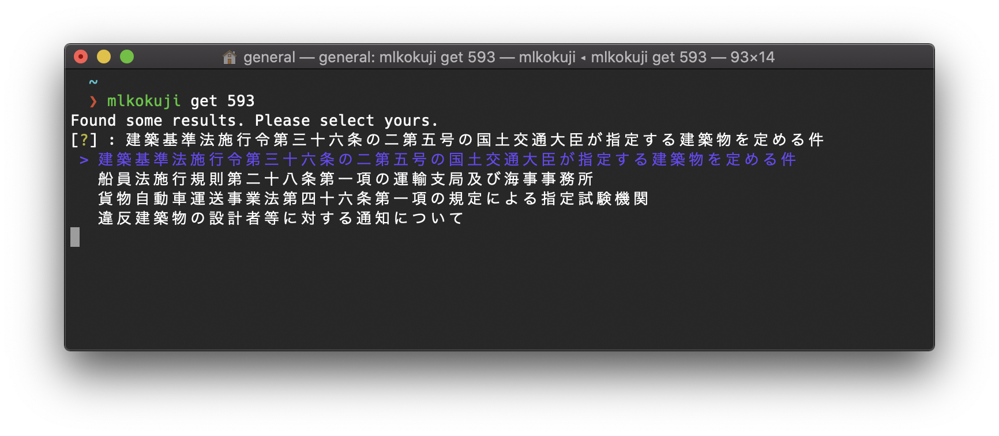

# mlit-kokuji

[国交省のWebサイト](https://www.mlit.go.jp/notice/)において、Excelファイル・PDFファイルにて配布されている告示一覧を用いて、告示を検索し表示するCLIツールです。告示番号1234には、

- 1234
- 一二三四
- 千二百三十四

が用いられますが、それらをまとめて検索することが可能です。




## Install

パッケージマネージャーの[Homebrew](https://brew.sh/index_ja)を用いてインストールします。

```sh
brew tap ryuhey0123/mlkokuji
brew install mlkokuji
```

使用前に下記のコマンドを実行して、キャッシュファイルをアップデートしてください。

```sh
mlkokuji update
```


## Usage

検索対象の告示番号をコマンド `get` に続けて入力します。

```sh
mlkokuji get 593
```

検索結果一覧が表示されるので、矢印キーで選択し`Enter`キーを入力すると規定のブラウザでリンクを開きます。

```sh
$ mlkokuji get 593
Found some results. Please select yours.
[?] : 建築基準法施行令第三十六条の二第五号の国土交通大臣が指定する建築物を定める件
 > 建築基準法施行令第三十六条の二第五号の国土交通大臣が指定する建築物を定める件
   船員法施行規則第二十八条第一項の運輸支局及び海事事務所
   貨物自動車運送事業法第四十六条第一項の規定による指定試験機関
   違反建築物の設計者等に対する通知について
```

なお、結果が唯一の場合は選択表示はなく、自動的に該当書類を開きます。

| Command    | Does                                         |
| ---------- | -------------------------------------------- |
| `get args` | argsに指定された告示番号を検索します         |
| `update`   | キャッシュをアップデートします。             |
| `clean`    | キャッシュディレクトリをゴミ箱に移動します。 |

※ キャッシュディレクトリを変更している場合の `clean` コマンドには注意してください。


## Settings

環境変数を変更することで、キャッシュディレクトリの変更が可能です。変更を永続的にするためには、`.zshrc`等に記載してください。

```sh
export MLKOKUJI_CACHE_DIR='path/to/dir'
```

デフォルト値は`$HOME/.cache/mlkokuji`となっています。

設定した環境変数を削除して、デフォルト値に戻すには、

```sh
unset MLKOKUJI_CACHE_DIR
```

としてください。


## License

[MIT](https://choosealicense.com/licenses/mit/)

